# 🌉 Gasless Cross-Chain Bridge

**Zero-friction cross-chain transfers powered by Permit2 + LayerZero**

[](https://soliditylang.org/)
[](https://layerzero.network/)
[](https://docs.uniswap.org/contracts/permit2/overview)
[](LICENSE)

## 🎯 The Problem

Cross-chain transfers traditionally require:

- Multiple on-chain approvals (each costs gas)
- Network switching and manual bridging
- High barrier for new users

## ✨ Our Solution

**Gasless Cross-Chain Bridge** - Users sign once (off-chain, free), relayer executes the entire bridge transaction.

### 📊 Flow Diagram

```mermaid
sequenceDiagram
    participant User
    participant Frontend
    participant Permit2
    participant Validator
    participant OFT
    participant LayerZero
    participant DestChain

    Note over User,DestChain: Gasless Cross-Chain Bridge Flow
    
    User->>Frontend: Request bridge 10 USDC
    Frontend->>Permit2: Get nonce (FREE - read only)
    Permit2-->>Frontend: Nonce = 3
    
    Note over User,Frontend: Step 1: Sign Permit (FREE - Off-chain)
    Frontend->>User: Request EIP-712 signature
    User->>User: Sign typed data
    User-->>Frontend: Signature ✅
    
    Note over Frontend,Validator: Step 2: Quote Fee
    Frontend->>Validator: quoteBridge()
    Validator-->>Frontend: Fee = 0.00001 ETH
    
    Note over Frontend,DestChain: Step 3: Execute Bridge (Relayer pays gas)
    Frontend->>Validator: receiveAndBridgeGasless(permit, signature)
    
    Note over Validator,OFT: All in ONE transaction
    Validator->>Permit2: permitTransferFrom()
    Permit2->>Permit2: Verify signature ✅
    Permit2->>OFT: transferFrom(user → validator)
    OFT-->>Validator: Tokens received
    
    Validator->>OFT: send(dstEid, recipient, amount)
    OFT->>OFT: burn(10 USDC) 🔥
    OFT->>LayerZero: Cross-chain message
    LayerZero->>DestChain: Send message
    DestChain->>DestChain: mint(recipient, 10 USDC)
    DestChain-->>User: Tokens received! ✅
    
    Validator-->>Frontend: Transaction confirmed
    Frontend-->>User: Bridge complete! 🎉
    
    Note over User,DestChain: User pays: $0 gas | Relayer pays: execution gas
```



### 🔑 Key Features

- ✅ **Gasless** - User signs off-chain (free), relayer pays all gas
- ✅ **One Transaction** - Permit2 pulls tokens and bridges in single TX
- ✅ **No Prior Approval** - Permit2 uses signature instead of `approve()`
- ✅ **Multi-Chain** - Deployed on 4 testnets (Sepolia, OP, Base, Arbitrum)

## 🚀 Deployed Contracts

**Validator Contracts** (verified on all chains ✅)

| Chain | Address | Explorer |
|-------|---------|----------|
| **Sepolia** | `0xd3605455441B7bF57489E05d6b1b678e269BDE3F` | [Blockscout](https://eth-sepolia.blockscout.com/address/0xd3605455441B7bF57489E05d6b1b678e269BDE3F#code) |
| **Optimism Sepolia** | `0x004690Ee41C0Dd2AcEf094D01b93b60aa9a06bb9` | [Blockscout](https://optimism-sepolia.blockscout.com/address/0x004690Ee41C0Dd2AcEf094D01b93b60aa9a06bb9#code) |
| **Base Sepolia** | `0x07b091cC0eef5b03A41eB4bDD059B388cd3560D1` | [Sourcify](https://sourcify.dev/server/repo-ui/84532/0x07b091cC0eef5b03A41eB4bDD059B388cd3560D1) |
| **Arbitrum Sepolia** | `0xbD57b37FEf0fda7151a0C0BdA957aE37BD84ab6B` | [Sourcify](https://sourcify.dev/server/repo-ui/421614/0xbD57b37FEf0fda7151a0C0BdA957aE37BD84ab6B) |

**OFT Tokens** (USDC Mock - 6 decimals)

| Chain | Address |
|-------|---------|
| **Sepolia** | `0x07b091cC0eef5b03A41eB4bDD059B388cd3560D1` |
| **Optimism Sepolia** | `0x4cd092a9d4623Fa16411F65d0339B5815895Ca24` |
| **Base Sepolia** | `0x004690Ee41C0Dd2AcEf094D01b93b60aa9a06bb9` |
| **Arbitrum Sepolia** | `0x004690Ee41C0Dd2AcEf094D01b93b60aa9a06bb9` |

---

## 📋 How It Works

**Traditional:** User approves (gas) → User bridges (gas) → Multiple transactions

**This Solution:** User signs (free) → Relayer executes everything in ONE transaction

## 🛠️ Technical Architecture

### Smart Contract

```solidity
function receiveAndBridgeGasless(
    PermitTransferFrom calldata permit,  // Permit2 signature data
    address owner,                        // Token owner
    bytes calldata signature,             // EIP-712 signature (off-chain)
    uint32 dstEid,                       // LayerZero destination endpoint
    address dstAddress,                   // Recipient on destination chain
    uint256 minAmountLD,                 // Minimum amount (slippage protection)
    bytes calldata extraOptions          // LayerZero options
) external payable;
```

### Technology Stack

- **Permit2** (Uniswap) - Signature-based token transfers
- **EIP-712** - Typed data signing standard
- **LayerZero V2** - Cross-chain messaging protocol
- **Solidity 0.8.28** - Latest compiler with `viaIR` optimization
- **Hardhat 3** - Development & deployment
- **Viem** - TypeScript Ethereum library

## 🎯 Real-World Use Cases

| Use Case | Benefit |
|----------|---------|
| 🎮 **Gaming** | Players bridge to game chains without gas costs |
| 💰 **DeFi** | One-click yield farming across chains |
| 🛒 **E-commerce** | Seamless checkout with stablecoins |
| 🎫 **NFTs & Events** | Frictionless cross-chain ticketing |

---

## 📊 Key Benefits

| Feature | Traditional Bridge | This Solution |
|---------|-------------------|---------------|
| **User Gas Cost** | Must pay gas for approvals + bridge | **$0 - Relayer pays** |
| **Approvals Needed** | Multiple on-chain approvals | **None - Uses Permit2 signatures** |
| **User Steps** | 1. Approve token<br>2. Switch network<br>3. Initiate bridge | **1. Sign once (off-chain)** |
| **Cross-Chain** | Limited chains | **4+ chains (Sepolia, OP, Base, Arbitrum)** |

---

## 🏃 Quick Start

### Installation

```bash
git clone https://github.com/RookieCol/eth_global_arg_contracts.git
cd eth_global_arg_contracts
npm install
```

### Setup

```bash
# Configure environment variables
cp .env.example .env
# Add: PRIVATE_KEY, RPC URLs, API keys

# One-time: Approve Permit2 on all chains
npm run approve-permit2
```

### Run Tests

```bash
# Test gasless bridge (Sepolia → Base)
npm run bridge-gasless

# Test other routes
npm run bridge-base-to-sepolia      # Base → Sepolia
npm run bridge-op-to-sepolia        # OP → Sepolia
npm run bridge-arb-to-sepolia       # Arbitrum → Sepolia
```

All tests are **working and verified** ✅

## 📖 Documentation

- **[Contract Source](./contracts/chainlink_permit2.sol)** - Validator smart contract
- **[Test Scripts](./test/)** - All working test examples
- **[Deployment Guide](./ignition/)** - Hardhat Ignition modules

### Live Transactions

- [Sepolia → Base](https://sepolia.etherscan.io/tx/0x8be93145510e0af4f2bdbbfed84df035ef5ebbb9b76cc5c0cdb19d3ac66be21d)
- [Base → Sepolia](https://sepolia.basescan.org/tx/0x9cc63b6d98718618729af2a0fe55c1b3644e4fbaa472224ba0618f1ab413180e)
- [OP → Sepolia](https://sepolia-optimism.etherscan.io/tx/0xb74472cec54446c565b1900c8fdfa894af03f77d05b11ff16802dd8b86cfb1a0)
- [Arbitrum → Sepolia](https://sepolia.arbiscan.io/tx/0x9e45a20a0e6784b20c906f97301d97e72c0056843e31c82c31154b13e1803523)

## 🔐 Security

- ✅ **EIP-712 Signatures** - Industry standard for typed data
- ✅ **Nonce Management** - Prevents replay attacks via bitmap
- ✅ **Deadline Enforcement** - Time-bound permissions
- ✅ **Permit2 by Uniswap** - Battle-tested, audited protocol
- ✅ **LayerZero V2** - Secure cross-chain messaging

## 📜 Smart Contract Functions

### Main Function: `receiveAndBridgeGasless`

Enables gasless cross-chain transfers using Permit2 SignatureTransfer + LayerZero.

**No `token.approve(Permit2)` needed!**

### Helper Function: `quoteBridge`

Returns the LayerZero fee for a bridge transaction.

```solidity
function quoteBridge(
    address token,
    uint32 dstEid,
    address dstAddress,
    uint256 amount,
    uint256 minAmountLD,
    bytes calldata extraOptions
) external view returns (uint256 nativeFee);
```

## 🏆 Hackathon Highlights

### Innovation

- ✅ First gasless bridge combining **Permit2 + LayerZero V2**
- ✅ Novel use of **SignatureTransfer** (no on-chain approve needed)
- ✅ Production-ready **multi-chain deployment** (4 testnets)
- ✅ **4 successful cross-chain bridges** validated on testnet

### Technology Stack

- **Permit2** (Uniswap) - EIP-712 signature-based transfers
- **LayerZero V2** - Secure cross-chain messaging
- **Solidity 0.8.28** - Optimized with `viaIR` compiler
- **Hardhat 3 + Viem** - Modern development tooling

### Verified Contracts

- ✅ **4 chains**: Sepolia, Optimism, Base, Arbitrum
- ✅ All contracts verified on Blockscout/Sourcify
- ✅ Battle-tested with real transactions

---

## 🛠️ Available Tools & Scripts

### Setup

```bash
# One-time setup: Approve Permit2 on all chains
npm run approve-permit2
```

### Test Scripts (All Working ✅)

```bash
# Bridge from Sepolia
npm run bridge-gasless              # Sepolia → Base

# Bridge to Sepolia
npm run bridge-base-to-sepolia      # Base → Sepolia
npm run bridge-op-to-sepolia        # OP → Sepolia  
npm run bridge-arb-to-sepolia       # Arbitrum → Sepolia
```

### Deployment

```bash
# Deploy validator to any chain
npm run deploy --network <network-name>
```

---

## 💡 Current Solution & Future Improvements

### ✅ What Works Now

**Current Implementation:**

- ✅ Users sign **off-chain** (EIP-712) - completely **free**
- ✅ Relayer executes transaction - pays the gas
- ✅ **Permit2** validates signature and transfers tokens
- ✅ **LayerZero V2** bridges across chains
- ✅ Fully tested on 4 testnets (Sepolia, OP, Base, Arbitrum)

**Key Innovation:**

- **No prior approval needed** - Traditional bridges require `token.approve()` which costs gas
- **Single signature** - User signs once, everything happens automatically
- **Gasless for users** - Only cost is LayerZero cross-chain fee, relayer pays execution gas

### 🔮 Production Enhancements

**Current Limitation:** Relayer must be manually operated

**Production Goal: Automated On-Chain Execution**

The objective is to integrate with on-chain automation solutions that eliminate manual relayer operations:

**Option 2: Gelato Functions with Account Abstraction**

- User signs permit (off-chain)
- Gelato Executor detects pending transactions
- Executes via Account Abstraction (ERC-4337)
- Executor is incentivized through fee-sharing model

**Option 3: Custom Event-Driven Relayer**

- Smart contract emits `BridgeRequested` event
- Off-chain relayer network listens for events
- First executor to process gets fee reward
- Economic incentives ensure 24/7 operation

**Key Benefits:**

- ✅ **Automated execution** - No manual intervention needed
- ✅ **Economic incentives** - Executors compete for fees
- ✅ **Decentralized** - Multiple executors can participate
- ✅ **Reliable** - On-chain automation ensures uptime

**Implementation Path:**

1. Add event emission to validator contract
2. Integrate with Chainlink Automation or Gelato
3. Implement fee-sharing mechanism
4. Deploy executor network

### 🔗 Future Goal: DeFi Composability

**Current Scope:** Bridge tokens across chains gaslessly

**Future Objective:** Extend this gasless model to compose with DeFi protocols in a single user signature

**Composability Vision:**

- **Bridge + Swap** → User bridges and swaps to target token (1inch, Uniswap)
- **Bridge + Lend** → User bridges and deposits to lending protocol (Aave, Compound)
- **Bridge + Vault** → User bridges and deposits to yield vault (Yearn, Beefy)
- **Bridge + Payment** → User bridges and initiates payment stream (Sablier, Superfluid)

**Key Concept:**
One signature from the user → Relayer executes entire flow (bridge + DeFi action) → User never pays gas

**Benefits:**

- ✅ Ultimate UX: One signature for complex multi-step operations
- ✅ Cross-chain DeFi accessible without gas barriers
- ✅ Works with any protocol on destination chain

---

## 🙏 Acknowledgments

- **Uniswap** - Permit2 protocol
- **LayerZero** - Cross-chain messaging  
- **Ethereum Foundation** - EIP-712 standard

---
